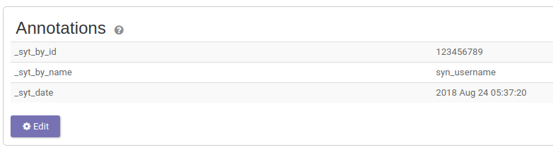
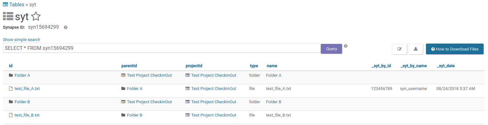

# Synapse Folder Check In/Out Tracking

A utility to track [Synapse](https://www.synapse.org/) Project, Folder, and File check ins/outs.

## Usage

```
usage: syt.py [-h] [-s] [-f] [-u USERNAME] [-p PASSWORD]
              {checkout,checkin,show} [entity-id] [checkout-path]

positional arguments:
  {checkout,checkin,show}
                        The command to execute.
  entity-id             The ID of the Synapse Entity to execute the command
                        on.
  checkout-path         The local path to sync with Synapse.

optional arguments:
  -h, --help            show this help message and exit
  -s, --sync            Download or upload when checking in/out.
  -f, --force           Force a check in/out.
  -u USERNAME, --username USERNAME
                        Synapse username.
  -p PASSWORD, --password PASSWORD
                        Synapse password.
```

## Examples

Checkout a folder (`syn001`) into `my_study_data`:
```bash
$ syt.py checkout syn001 my_study_data --sync
Checking out...
Logging into Synapse...
Loading Entity...
Loading Project...
Folder "Folder B" (syn001) from Project "Test Project CheckInOut" (syn002)
making dir my_study_data/Folder B-1
Downloading  [####################]100.00%   17.0bytes/17.0bytes (53.2kB/s) test_file_A.txt Done...
Downloading  [####################]100.00%   17.0bytes/17.0bytes (53.0kB/s) test_file_B.txt Done...
Checked out files:
  - ./my_study_data/Folder B-1/test_file_A.txt
  - ./my_study_data/test_file_B.txt
Check-out was successful
```
Note: After initial check-out you can re-check-out with `syt.py checkout my_study_data` or from inside `my_study_data` `syt.py checkout`.

Show the check-out status for `my_study_data`:
```bash
$ syt.py show my_study_data
Show Checked out entities...
Logging into Synapse...
Loading Entity...
Loading Project...
Folder "Folder B" (syn001) from Project "Test  Project CheckInOut" (syn002)
--------------------------------------------------------------------------------
Entity: Folder B (syn001)
Checked out by: my-user-name (3376664)
Checked out on: 2018-07-30 11:32:41.884000
```
Note: Can also be done with `syt.py show syn001` or from inside `my_study_data` `syt.py show`.

Check-in `my_study_data`:
```bash
$ syt.py checkin my_study_data --sync
Checking in...
Logging into Synapse...
Loading Entity...
Loading Project...
Folder "Folder B" (syn001) from Project "Test Project" (syn002)
Validation and upload of: my_study_data/SYNAPSE_METADATA_MANIFEST.tsv
Validating columns of manifest.....OK
Validating that all paths exist..OK
Validating that all files are unique...OK
Validating provenance...OK
Validating that parents exist and are containers...OK
==================================================
We are about to upload 2 files with a total size of 34.0bytes.
 ==================================================
Starting upload...
Check-in was successful
```
Note: Can also be done with `syt.py checkin syn001 my_study_data` or from inside `my_study_data` `syt.py checkin`.


## Implementation

Check-outs are tracked on each Project/Folder/File as [Annotations](https://docs.synapse.org/articles/annotation_and_query.html).
When an entity is checked out the annotations are added and then removed when the entity is checked back in.


Check-out validation is done via a table [View](https://docs.synapse.org/articles/views.html) in the Project.
This View contains all Folders and Files in the Project along with the Syt annotations.

