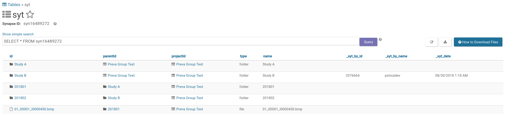

# Demo

#### Synapse Project Files


___

#### Check-out the "Study A" folder

```shell
$ syt checkout syn16472007

Checking out...
Logging into Synapse...
Loading Entity...
Loading Project...
Folder "Study A" (syn16472007) from Project "Preva Group Test" (syn16471965)
Checking Parent Check-outs...
Checking Child Check-outs...
Check-out was successful
```

#### "Study A" annotations


#### Syt File View


___

#### Try to check-out the "Study A" folder again

```shell
$ syt checkout syn16472007

Checking out...
Logging into Synapse...
Loading Entity...
Loading Project...
Folder "Study A" (syn16472007) from Project "Preva Group Test" (syn16471965)
Entity already checked out by pstoutdev. Aborting.
```

___

#### Check-out the "Study B" folder

```shell
$ syt checkout syn16472089

Checking out...
Logging into Synapse...
Loading Entity...
Loading Project...
Folder "Study B" (syn16472089) from Project "Preva Group Test" (syn16471965)
Checking Parent Check-outs...
Checking Child Check-outs...
Check-out was successful
```

___

#### Show all checked out entities in the project

```shell
$ syt show syn16471965

Show Checked out entities...
Logging into Synapse...
Loading Entity...
Loading Check-outs...
--------------------------------------------------------------------------------
Folder: Study A (syn16472007)
Checked out by: pstoutdev (3376664)
Checked out on: 2018-08-30 10:04:32.564000
--------------------------------------------------------------------------------
Folder: Study B (syn16472089)
Checked out by: pstoutdev (3376664)
Checked out on: 2018-08-30 09:53:10.228000

```

___

#### Check-out a file when parent folder is checked out

```shell
$ syt checkout syn16478776

Checking out...
Logging into Synapse...
Loading Entity...
Loading Project...
File "02_00009_I0000447.dcm" (syn16478776) from Project "Preva Group Test" (syn16471965)
Checking Parent Check-outs...
Parent: Study B (syn16472089) is checked out by pstoutdev. Aborting.
```

___

#### Check-in the "Study A" folder

```shell
$ syt checkin syn16472007

Checking in...
Logging into Synapse...
Loading Entity...
Loading Project...
Folder "Study A" (syn16472007) from Project "Preva Group Test" (syn16471965)
Check-in was successful
```
